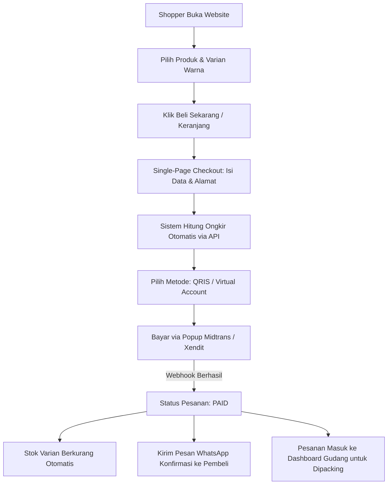

# Product Requirement Document (PRD) — E-Commerce Tas Premium (D2C)

**Versi**: 1.0.0  
**Tanggal**: 03 Oktober 2026  
**Direktori Proyek**: `D:\program file\Laravel\e-comerce-tas`  
**Status**: APPROVED (Post-Discovery)  
**Lead Project & Head of Product**: Geta  

---

## 1. Ringkasan & Tujuan
- **Masalah**: Pembeli tas online sering membatalkan niat beli atau meninggalkan keranjang belanja (*abandoned cart*) karena proses checkout yang rumit, ketidakpastian ongkos kirim, keterbatasan metode pembayaran instan, serta lambatnya konfirmasi status pesanan setelah transfer.
- **Solusi**: Platform e-commerce *Direct-to-Consumer (D2C)* khusus tas dengan katalog visual butik modern, checkout 1 halaman (*Single-Page Guest Checkout*), integrasi multi-kurir otomatis, pembayaran instan QRIS/VA melalui payment gateway resmi, dan notifikasi konfirmasi WhatsApp seketika.
- **Target User**: Konsumen retail tas (pekerja, mahasiswa, traveler) dan tim operasional admin/gudang toko.

---

## 2. Model Bisnis
- **Value Proposition**: Tas berkualitas butik & fungsionalitas tinggi dengan pengalaman belanja instan tanpa hambatan pendaftaran akun yang bertele-tele.
- **Monetisasi**:
  - Penjualan langsung produk ritel (*Direct Product Sales*) dengan margin kotor target 55% - 65%.
  - Peningkatan AOV melalui cross-selling aksesoris (raincover, card holder) dan layanan kustom monogram/emboss inisial.
- **Metrik Sukses (KPI)**:
  - Rasio konversi checkout $\ge 4.5\%$.
  - Waktu transaksi dari klik barang hingga bayar QRIS $< 60$ detik.
  - Penurunan tingkat *unpaid order* melalui follow-up WhatsApp instan.

---

## 3. Roles & User Stories
1. **Shopper (Customer / Pembeli)**:
   - *Sebagai pembeli*, saya ingin memilih varian tas dan langsung checkout dalam 1 halaman dengan QRIS/VA agar saya tidak perlu membuat akun dan mengingat password baru.
   - *Acceptance Criteria*: Guest checkout aktif; input nama + WA + alamat langsung memicu pilihan kurir & tombol bayar.
2. **Admin Toko & Gudang**:
   - *Sebagai staf gudang*, saya ingin melihat daftar pesanan yang sudah lunas secara real-time dan langsung mencetak label pengiriman agar proses packing cepat selesai.
   - *Acceptance Criteria*: Status pesanan otomatis berubah ke *PAID* begitu webhook pembayaran masuk; tombol cetak resi thermal 10x15 cm tersedia.
3. **Owner / Manajemen (Fariz)**:
   - *Sebagai pemilik*, saya ingin melihat laporan omset harian, varian tas terlaris, dan margin penjualan tanpa perlu rekap manual.
   - *Acceptance Criteria*: Dashboard ringkasan pendapatan dan grafik penjualan real-time.

---

## 4. Fitur & Scope (MVP → v1 → vNext)

| ID | Fitur | Prioritas | Status | Dokumen Terkait |
| :--- | :--- | :--- | :--- | :--- |
| **FEAT-01** | Fondasi Auth & Manajemen Multi-Varian Produk & Brand | P0 (MVP) | Completed | [`docs/features/product-and-variants.md`](docs/features/product-and-variants.md) |
| **FEAT-02** | 3D Interactive Hero & Multi-Media Card Slider Three.js | P0 (MVP) | Completed | [`docs/features/product-and-variants.md`](docs/features/product-and-variants.md) |
| **FEAT-03** | Server-Ready 3D GLB Compression (Draco & WebP) | P0 (MVP) | Completed | [`docs/features/product-and-variants.md`](docs/features/product-and-variants.md) |
| **FEAT-04** | Storefront Detail Page & Universal Media Lightbox (Photo + 3D) | P0 (MVP) | Completed | [`docs/features/product-and-variants.md`](docs/features/product-and-variants.md) |
| **FEAT-05** | Single-Page Direct Checkout (Guest & Registered + COD / VA / QRIS) | P0 (MVP) | Completed | [`docs/features/single-page-checkout.md`](docs/features/single-page-checkout.md) |
| **FEAT-06** | Perhitungan Ongkir & Integrasi Kurir (JNE, SiCepat, COD Bebas Ongkir) | P0 (MVP) | Completed | `docs/features/shipping-logistics-api.md` |
| **FEAT-07** | Payment Gateway Instan Midtrans Snap & Webhook Listener (QRIS / VA) | P1 (v1) | Completed | `docs/features/payment-gateway-instant.md` |
| **FEAT-08** | Notifikasi & Direct Order WhatsApp CS Resmi (1-Klik wa.me Template) | P1 (v1) | Completed | `docs/features/whatsapp-notifications.md` |
| **FEAT-09** | Admin Order Fulfillment, Pencarian Multi-Kolom & Cetak Label Thermal 10x15cm | P1 (v1) | Completed | `docs/features/admin-order-fulfillment.md` |
| **FEAT-10** | Cetak Invoice Resmi Toko Standar A4 / PDF Tax Invoice | P1 (v1) | Completed | `docs/features/admin-order-fulfillment.md` |
| **FEAT-11** | Manajemen Galeri Foto (Hapus Fisik WebP & Jadikan Foto Utama) | P1 (v1) | Completed | [`docs/features/product-and-variants.md`](docs/features/product-and-variants.md) |
| **FEAT-12** | Integrasi Auto-Post Facebook Page Resmi Toko via Meta Graph API v20.0 | P1 (v1) | Completed | `docs/features/social-commerce.md` |

---

## 5. Alur Kerja (Workflow)

---

## 6. Skema Database / Model Inti
- `categories`: `id`, `name`, `slug`, `icon` (contoh: Handbag, Shoulder Bag, Totebag, Sling Bag, Ransel, Clutch)
- `products`: `id`, `category_id`, `name`, `slug`, `description`, `material`, `dimensions_cm`, `capacity_liter`, `weight_grams`, `is_active`
- `product_variants`: `id`, `product_id`, `sku`, `color_name`, `color_hex`, `price`, `promo_price`, `stock`
- `product_images`: `id`, `product_id`, `variant_id` (nullable), `image_path` (WebP), `is_primary`
- `orders`: `id`, `order_number`, `customer_name`, `customer_phone`, `customer_email`, `address_line`, `district_id`, `courier_code`, `courier_service`, `shipping_cost`, `subtotal`, `grand_total`, `status` (`pending`, `paid`, `processing`, `shipped`, `completed`, `cancelled`)
- `order_items`: `id`, `order_id`, `variant_id`, `product_name`, `variant_name`, `unit_price`, `quantity`, `total_price`
- `payments`: `id`, `order_id`, `gateway`, `transaction_id`, `payment_type`, `amount`, `status`, `raw_payload`

---

## 7. Kontrak API & Keamanan
- **CSRF Token**: Proteksi penuh pada setiap transaksi Livewire / form.
- **Idempotency Webhook**: Verifikasi signature key gateway (`SHA512`) dan pengecekan agar pesanan tidak mengalami double-paid atau double-stock-deduction.
- **Sanitasi Nomor WhatsApp**: Normalisasi awalan `08...` ke format internasional `628...` sebelum memicu pesan gateway.

---

## 8. UI/UX & Tema Desain (Bespoke Anti-Slop)
- **Karakter Visual**: Butik modern minimalis (*clean luxury*).
- **Tipografi**: *Plus Jakarta Sans* untuk teks navigasi & isi, *Space Grotesk* untuk aksen heading harga dan judul produk.
- **Palet Warna**: Base Dark Luxe / Warm Soft Beige, Aksen Terracotta / Emerald, border tipis bertekstur halus, tanpa bayangan blur berlebihan yang murahan.

---

## 9. Milestone & Deliverables
- **M1 (Sprint 1)**: Inisialisasi Laravel 11, Tailwind, skema migrasi database & seeder master data tas.
- **M2 (Sprint 2)**: Katalog produk interaktif, galeri foto per varian warna, drawer keranjang belanja.
- **M3 (Sprint 3)**: Single-page checkout, integrasi ongkir kurir, payment gateway QRIS & VA, auto-deduct stok.
- **M4 (Sprint 4)**: Webhook listener, otomasi notifikasi WhatsApp, panel admin pemrosesan pesanan & cetak label resi.

---

## 10. Changelog PRD
- **2026-10-03**: Penerbitan PRD v1.0.0 pasca-discovery dengan Fariz (Konfirmasi scope D2C, fokus checkout instan QRIS/VA + notifikasi WA, stack Laravel 11 + Livewire 3 + Tailwind).
